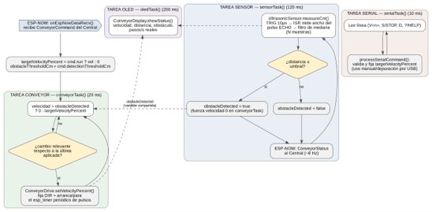

# Cinta/ — cinta transportadora

Firmware de la cinta transportadora, sobre un ESP32-C3. A diferencia de las seis articulaciones del brazo, aquí no hay ningún encoder: el motor NEMA17 se mueve en lazo **abierto**, controlando velocidad y no una posición angular. Lo único que sí cierra un lazo real es la seguridad: un sensor ultrasónico HC-SR04 que para la cinta en cuanto detecta una pieza demasiado cerca. El diagrama de abajo muestra las cuatro tareas descritas más adelante y cómo se relacionan entre sí.

## Cómo se le habla a la cinta

Se puede controlar de dos formas independientes, y ambas escriben sobre la misma variable de velocidad objetivo:

- **Por ESP-NOW**, recibiendo un `ConveyorCommand` del Central (que a su vez lo reenvía desde el PC o desde una rutina de la app).
- **Por Serie**, directamente con un monitor serie a 115200 baudios, útil para pruebas sin tener el resto del sistema encendido: `V50` (50 % de velocidad hacia delante), `V-30` (30 % hacia atrás), `S` o `STOP` (parar), `D` (consultar la última distancia medida) y `?` (ayuda).

## Las cuatro tareas de FreeRTOS

El `main.cpp` no usa `loop()` para nada — todo corre en cuatro tareas independientes, todas a la misma prioridad, porque ninguna genera directamente los pulsos del motor (de eso se encarga un temporizador de hardware propio dentro de `ConveyorDrive`, así que ninguna tarea puede "robarle" tiempo al motor por estar ocupada):

- **`conveyorTask` (cada 20 ms)** — el supervisor de velocidad. Compara la velocidad objetivo con la última aplicada y, si hay un cambio relevante, se lo pasa a `ConveyorDrive::setVelocityPercent()`. Aquí es donde se aplica la regla de seguridad: si `obstacleDetected` está activo, se fuerza velocidad 0 pase lo que pase con la velocidad pedida, y en cuanto el sensor deja de ver la pieza la cinta retoma sola la velocidad que ya tenía pedida, sin que nadie tenga que reenviar el comando.
- **`sensorTask` (cada 120 ms)** — mide con el HC-SR04 a través de `UltrasonicSensor::measureCm()`, decide si hay obstáculo comparando contra el umbral configurado, y manda ese estado al Central por ESP-NOW en cada ciclo (unas 8 veces por segundo), que es lo que usa la app para las condiciones "pieza detectada / no detectada" de una rutina.
- **`serialTask` (cada 10 ms)** — lee el puerto serie carácter a carácter, arma la línea de comando y la valida con `processSerialCommand()`. Cualquier entrada que no encaje con los comandos soportados se rechaza con un mensaje claro en vez de interpretarse en silencio como una velocidad 0.
- **`oledTask` (cada 200 ms)** — pinta en la pantalla OLED SSD1306 la velocidad objetivo, la distancia medida, si hay obstáculo y los pasos/segundo que realmente está aplicando el driver. Va en su propia tarea a propósito: las llamadas I2C a la pantalla tardan varios milisegundos, y si vivieran en la misma tarea que decide la velocidad del motor introducirían pausas irregulares en el movimiento.

## Las librerías

- **ConveyorDrive** — genera el tren de pulsos PUL/DIR para el driver TB6600 mediante un temporizador de hardware (`esp_timer`), calculado una única vez por cambio de velocidad en vez de recalcularse en cada ciclo.
- **UltrasonicSensor** — envoltorio del HC-SR04, con filtro de mediana sobre varias muestras para no reaccionar a una lectura suelta con ruido.
- **ConveyorDisplay** — envoltorio de la pantalla OLED SSD1306 de 0.42".
- **ConveyorConfig** — pines, dirección MAC del Central, velocidad máxima y demás constantes de esta placa.
- **ConveyorProtocol** — las estructuras `ConveyorCommand` y `ConveyorStatus` que viajan por ESP-NOW; tienen que coincidir exactamente con las que usa el Central.
