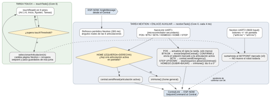

# Mando/ — teach pendant

Firmware del mando físico (pendant), sobre un ESP32-S3. Es la única forma de mover el robot sin necesidad de tener el PC encendido: combina una pantalla táctil Nextion, una rueda encoder con pulsador, botones táctiles capacitivos y una seta de emergencia, y habla con el Central por su propio enlace ESP-NOW. El diagrama de abajo resume el recorrido completo de un evento, desde que se toca la pantalla o se gira la rueda hasta que sale un `SetpointCommand` hacia el Central.

## Una particularidad: dos orígenes de entrada

El mando no lee la rueda, el pulsador ni la seta directamente: eso lo hace un microcontrolador secundario, que se lo reporta por UART a través de `NanoLink` con mensajes de texto simples (`POS:123.4`, `BTN:OK`, `SETA:PULSADA`, `HOME`, `HOMEGO`, `STEP:UP`...). La pantalla Nextion, en cambio, sí está conectada directamente al ESP32-S3 por su propio UART, gestionada por `NextionUi`. El firmware de este microcontrolador auxiliar no forma parte de este repositorio.

## El "setpoint marcado" no es lo mismo que el ángulo real

Esta es la idea central de todo el firmware: girar la rueda o tocar los botones +/- de la pantalla **no mueve el robot**. Solo cambia un valor que se está "marcando" (la variable `pos`, reflejada en el campo `x0` de la Nextion) para la articulación que esté activa en ese momento. El robot solo se mueve cuando se confirma ese valor pulsando la rueda (mensaje `BTN:OK`), momento en el que `enviarSetpointCentral()` lo manda de verdad al Central. Este mismo valor marcado se recuerda por articulación (`setpointsPorArticulacion[6]`), igual que el escalón de incremento de la rueda (ver `StepSequence` más abajo), así que cambiar de página y volver no hace perder lo que se estaba ajustando.

## Las dos tareas de FreeRTOS

- **`touchTask` (cada 100 ms, Core 0)** — sondea los nueve pulsadores táctiles capacitivos (`touchRead()` contra un umbral) para navegar entre las seis páginas de articulación, la pantalla de inicio, ajustes y tareas. Al entrar en la página de una articulación, `seleccionarArticulacion()` recupera tanto el setpoint marcado como el escalón de paso que se estaban usando ahí, o arranca desde el ángulo real si es la primera vez que se visita.
- **`nextionTask` (cada 4 ms, Core 0, prioridad más alta)** — el centro de gravedad del firmware. En cada vuelta atiende, por este orden: los eventos táctiles que llegan de la propia Nextion (botones +/- de ángulo y de velocidad de cada página), los mensajes del enlace auxiliar (rueda, pulsador OK, seta, combinaciones HOME/HOMEGO, escalón), y cada 300 ms refresca en pantalla los ángulos actuales de las seis articulaciones — pero solo los campos que realmente cambiaron, para no saturar el UART de la Nextion, que va a 9600 baudios.

Dos combinaciones de pulsadores físicos tienen un comportamiento especial: **SUBIR+BAJAR** (`HOMEGO`) manda las seis articulaciones a home real (0°) sin importar qué página esté activa; **IZQUIERDA+DERECHA** (`HOME`) resetea solo la articulación que se esté viendo en ese momento, o hace lo mismo que `HOMEGO` si no hay ninguna página de articulación abierta.

## Las librerías

- **NextionUi** — envoltorio del UART hacia la pantalla Nextion: cambio de página, envío de valores numéricos a sus campos y actualización de las barras de grados.
- **NanoLink** — el UART hacia el microcontrolador secundario que lee la rueda, el pulsador, la seta y los botones físicos.
- **CentralLink** — el enlace ESP-NOW con el Central: construye y manda el `SetpointCommand` de cada articulación, la emergencia remota y el reset, y guarda el último ángulo reportado de cada una para poder mostrarlo en pantalla.
- **StepSequence** — la secuencia cíclica de incrementos que recorren los pulsadores SUBIR/BAJAR (0.01, 0.1, 0.5, 1.0, 1.5 ... 10.0), recordada de forma independiente para cada una de las seis articulaciones.
- **MandoOta** — actualización de firmware por WiFi con ventana de 30 s al arrancar, igual que en el resto de nodos del sistema.
- **MandoConfig** — pines, direcciones MAC y demás constantes de esta placa.
- **EspNowProtocol** — las mismas estructuras de mensaje que usan el Central y las seis articulaciones; tienen que coincidir exactamente en los ocho firmwares.
